# 🏛️ Architecture: AccessControl

## Universal Access Control & Smart Lock/Keypad Synchronization Platform

AccessControl is a high-performance, containerized access control and physical lock/keypad management daemon built with **.NET 10 (`net10.0`)**, **C# 13**, **SQLite WAL**, and a modern **React 19 + TypeScript + Zustand** frontend. It replaces legacy integrations like Keymaster by adopting the **Frigate architecture pattern**: shifting complex state machines, hardware slot synchronization, scheduling, and credential evaluation into an isolated daemon while exposing a minimal footprint to Home Assistant.

---

## 1. System Overview

AccessControl solves the chronic instability, entity explosion, and hardware limitations of previous lock managers:

- **Dual Deployment Model**:
  - **Container-First (Primary)**: Standard Docker container running in Docker Compose or Kubernetes, binding to port `8150`, connecting over MQTT to Mosquitto.
  - **Home Assistant Add-on (Phase 2 Ready)**: Ingress-ready container (`addon/config.yaml`) negotiating with the Home Assistant Supervisor MQTT broker. The frontend and backend dynamically support `X-Ingress-Path` header rewriting.
- **>98% Entity Bloat Reduction**: Eliminates Keymaster's ~501 entities per lock. AccessControl registers only **3–4 clean entities per door** via Home Assistant MQTT Discovery (1 Lock Proxy, 1 `EventEntity`, 1 Door Contact Sensor, 1 Auto-Lock Switch).
- **Decoupled Architecture**: Inbound MQTT messages stream into an in-memory `System.Threading.Channels.Channel<MqttInboundMessage>`, isolating transport I/O from policy evaluation.
- **Pluggable Providers**: Supports disparate hardware configurations—such as pairing an external **Ring Keypad** with an internal **August Deadbolt**, or synchronizing hardware PIN slots on a **Schlage Z-Wave Deadbolt**.
- **Model Context Protocol (MCP)**: Native embedded MCP server (`/mcp` and `/sse`) allowing AI coding agents and home automation bots to audit doors, provision guest PINs, and inspect security telemetry.

---

## 2. The 12 Core Architectural Tenets

1. **.NET 10 High-Performance Engine**: Built on `net10.0` with strict nullability (`<Nullable>enable</Nullable>`), implicit usings, and treat warnings as errors (`<TreatWarningsAsErrors>true</TreatWarningsAsErrors>`).
2. **Relational Persistence over Heavy ORMs**: Zero external DB dependencies. Utilizes embedded **SQLite WAL** (`PRAGMA journal_mode = WAL; PRAGMA synchronous = NORMAL; PRAGMA busy_timeout = 5000; PRAGMA foreign_keys = ON;`) coupled with **Dapper** and parameterized SQL queries for predictable sub-millisecond execution.
3. **Decoupled Producer-Consumer Pipeline**: MQTT ingestion is decoupled via bounded `System.Threading.Channels.Channel<MqttInboundMessage>`, preventing transport delays from stalling state evaluation or DB writes.
4. **Pluggable, Capability-Driven Hardware Providers**: Clear interface boundaries (`ILockProvider`, `IKeypadProvider`, `IDoorSensorProvider`) allow arbitrary combinations of locks, keypads, and contact sensors regardless of protocol (Z-Wave, Zigbee, Ring, MQTT, Virtual).
5. **Zero Entity Bloat in Home Assistant**: Follows the Frigate pattern—rich state remains inside AccessControl, publishing only 3–4 standard MQTT discovery entities per door and emitting discrete `EventEntity` state notifications.
6. **Dual Notification Dispatch**: Real-time alerts dispatch concurrently through Home Assistant MQTT events (`event.<door>_access`) and direct webhook alerts to the local **Apprise** notification gateway.
7. **Universal Auto-Lock & Contact Sensor Intelligence**: Resilient state machine tracking door open/closed contact states with independent Day/Night countdown timers and automatic retry on mechanical lock jams.
8. **Model Context Protocol (MCP First)**: First-class MCP tool endpoints allowing autonomous agents to query doors, provision temporary credentials, and inspect audit logs via structured protocols.
9. **100% UI-Driven Configuration & Ingress-Ready UX**: Zero YAML or code editing required for end users. Pure React 19 + TypeScript (strict) + Zustand SPA supporting standalone browsing and Home Assistant Ingress embedding.
10. **SOLID, Modularity & Strict Interface Segregation**: Every class adheres to single responsibility (<500 LOC per file); semantic role-based naming (banning `*Manager`, `*Helper`); narrow `I*` client-focused interfaces for 100% testability; and ubiquitous `CancellationToken` propagation.
11. **Controls & Simulation Testing Mindset**: Dedicated test harnesses (`AccessControl.Tests.Harness`), synthetic MQTT broker loopbacks, simulated hardware drivers (`AccessControl.Tests.Simulator`), and Playwright 4-point UX audits targeting >80% coverage.
12. **4-Stage CI/CD Quality Gates & Living Documentation**: Automated release verification (`verify_release.py`), parallel build and test execution, integration smoke testing, and living architecture specifications maintained in-tree.

---

## 3. High-Level System Topology

```mermaid
flowchart TD
    subgraph Clients["Clients & Integration Gateways"]
        WebUI["React 19 SPA (Zustand + Vite)<br/>Standalone (Port 8150) / HA Ingress"]
        HA["Home Assistant Core<br/>(MQTT Discovery & EventEntity)"]
        Apprise["Apprise Gateway<br/>(apprise.wileyriley.com)"]
        Agent["AI Agents / MCP Clients<br/>(via /mcp and /sse)"]
    end

    subgraph Host["AccessControl Container (.NET 10 Daemon)"]
        subgraph WebLayer["AccessControl.Web & Mcp"]
            Controllers["REST Controllers & Ingress Middleware"]
            McpServer["Embedded MCP Server"]
            Hub["SSE Live Event Broadcaster"]
        end

        subgraph Ingestion["Message Ingestion & Pipelines"]
            MqttClient["MqttInboundWorker (MQTTnet)"]
            Channel["Channel&lt;MqttInboundMessage&gt;"]
        end

        subgraph Engine["AccessControl.Engine"]
            PolicyEval["AccessPolicyEvaluator"]
            SlotWorker["HardwareSlotSyncWorker"]
            AutoLockWorker["AutoLockWorker"]
            Notifier["NotificationDispatcher"]
        end

        subgraph Providers["Hardware Abstraction Providers"]
            LockProv["ILockProvider<br/>(Z-Wave JS UI, Zigbee2MQTT, Generic, Virtual)"]
            KeypadProv["IKeypadProvider<br/>(Ring MQTT, Z2M Keypad, Built-In, Wiegand)"]
            SensorProv["IDoorSensorProvider<br/>(MQTT Contact, Home Assistant State)"]
        end

        subgraph Persistence["AccessControl.Data"]
            DbFactory["IDbConnectionFactory (SqliteConnectionFactory)"]
            Dapper["Dapper Repositories (User, AccessPoint, AuditLog)"]
            SqliteDB[("SQLite WAL Database<br/>(accesscontrol.db)")]
        end
    end

    subgraph Hardware["Physical Devices & Bridges"]
        Broker["Mosquitto MQTT Broker<br/>(Port 1883)"]
        ZWave["Z-Wave JS UI<br/>(Schlage / Yale / August)"]
        Ring["ring-mqtt<br/>(Ring Keypad v2)"]
        Zigbee["Zigbee2MQTT<br/>(Centralite / Linkind Keypads)"]
    end

    WebUI <-->|REST API & SSE| Controllers
    Agent <-->|JSON-RPC Tools| McpServer
    Broker <-->|MQTT Pub/Sub| MqttClient
    MqttClient -->|Enqueue| Channel
    Channel -->|Dequeue| PolicyEval
    PolicyEval -->|Evaluate & Authorize| Dapper
    PolicyEval -->|Trigger Unlock / Lock| LockProv
    PolicyEval -->|Dispatch Events| Notifier
    SlotWorker -->|Sync Slots| LockProv
    AutoLockWorker -->|Monitor Contact & Lock| SensorProv
    AutoLockWorker -->|Timed Re-lock| LockProv
    LockProv <-->|MQTT Commands & Telemetry| Broker
    KeypadProv <-->|MQTT Keypad Events| Broker
    SensorProv <-->|MQTT State Updates| Broker
    Notifier -->|HA MQTT Discovery & Events| Broker
    Notifier -->|HTTP Webhook| Apprise
    Dapper --> DbFactory
    DbFactory --> SqliteDB
    Broker <--> ZWave
    Broker <--> Ring
    Broker <--> Zigbee
```



---

## 4. End-to-End Operational Sequences

### 4.1 Flow A: Standalone Keypad -> Separate Lock (Ring Keypad -> August Deadbolt)

This scenario demonstrates a stateless event-driven keypad triggering an independent smart lock through AccessControl's policy evaluation engine.

```mermaid
sequenceDiagram
    autonumber
    actor User as Steve (User)
    participant Keypad as Ring Keypad v2
    participant RingMqtt as ring-mqtt Bridge
    participant Broker as Mosquitto MQTT
    participant Ingest as MqttInboundWorker
    participant Channel as Channel&lt;MqttInboundMessage&gt;
    participant Engine as AccessPolicyEvaluator
    participant Repo as UserRepository / AccessPointRepository
    participant DB as SQLite WAL Database
    participant LockProv as VirtualLockProvider / ZWaveJsMqtt
    participant ZWave as Z-Wave JS UI
    participant Deadbolt as August Smart Lock
    participant Notifier as NotificationDispatcher
    participant HA as Home Assistant
    participant Apprise as Apprise Service

    User->>Keypad: Enters PIN '4821' + presses [Disarm]
    Keypad->>RingMqtt: Z-Wave Entry Control Notification
    RingMqtt->>Broker: Publish ring/location/alarm/command { pin: "4821", action: "disarm" }
    Broker->>Ingest: Inbound MQTT Packet
    Ingest->>Channel: Enqueue(MqttInboundMessage)
    Channel->>Engine: Dequeue message for processing
    Engine->>Repo: Fetch AccessPoint & Assignments for Topic
    Repo->>DB: Query AccessPoints, Credentials, Policies
    DB-->>Repo: Return Assigned Policies & Hashed Credentials
    Repo-->>Engine: User: 'Steve', Policy: 'Always Active', Valid: true
    Engine->>Engine: Verify PIN hash matches stored salted hash
    Engine->>DB: INSERT INTO AccessLogs (User: 'Steve', Event: 'Unlocked', Method: 'RingKeypad')
    
    par Unlock Hardware Deadbolt
        Engine->>LockProv: UnlockAsync(Side Door)
        LockProv->>Broker: Publish zwave/side_door/door_lock/endpoint_0/targetState/set = false
        Broker->>ZWave: Relay command
        ZWave->>Deadbolt: Motor retracts deadbolt
    and Notify Home Assistant
        Engine->>Notifier: DispatchAccessEventAsync(Steve, 'Unlocked', 'RingKeypad')
        Notifier->>Broker: Publish homeassistant/event/accesscontrol/side_door/state { user: "Steve", method: "RingKeypad" }
        Broker->>HA: Trigger event.side_door_access
    and Dispatch Push Notification
        Engine->>Notifier: DispatchAppriseAlertAsync(...)
        Notifier->>Apprise: POST /notify/apprise ("Steve unlocked Side Door via Ring Keypad")
    end
```

---

### 4.2 Flow B: Physical Lock with Built-In Keypad (Schlage Deadbolt Slot Provisioning & Sync)

This scenario illustrates scheduled slot synchronization on physical hardware with onboard NVRAM (e.g. Schlage, Yale, Kwikset), followed by local execution and automated code expiry.

```mermaid
sequenceDiagram
    autonumber
    actor Admin as Home Administrator
    participant UI as React SPA (Web UI)
    participant Api as AccessPointController
    participant DB as SQLite WAL Database
    participant SyncWorker as HardwareSlotSyncWorker
    participant LockProv as ZWaveJsMqttLockProvider
    participant Broker as Mosquitto MQTT
    participant ZWave as Z-Wave JS UI
    participant Lock as Schlage BE469 Deadbolt
    actor Cleaner as Service Cleaner
    participant Ingest as MqttInboundWorker
    participant Notifier as NotificationDispatcher

    Admin->>UI: Assign Cleaner (PIN: 9182, Schedule: Wed 9am-1pm) to Front Door
    UI->>Api: POST /api/doors/{id}/assignments
    Api->>DB: INSERT INTO AccessAssignments & HardwareSlots (Slot 3, Status: 'Adding')
    DB-->>Api: Confirmed
    Api-->>UI: UI shows Slot 3 status 'Syncing...'

    Note over SyncWorker: Periodic slot reconciliation loop executes
    SyncWorker->>DB: SELECT * FROM HardwareSlots WHERE SyncStatus = 'Adding'
    DB-->>SyncWorker: Slot 3: User 'Cleaner', Code '9182'
    SyncWorker->>LockProv: SetSlotCodeAsync(Front Door, Slot 3, "9182", "Cleaner")
    LockProv->>Broker: Publish zwave/front_door/user_code/endpoint_0/set { slot: 3, usercode: "9182" }
    Broker->>ZWave: Dispatch UserCode CC
    ZWave->>Lock: Write PIN to Slot 3 NVRAM
    Lock-->>ZWave: Acknowledge NVRAM Write
    ZWave->>Broker: Publish zwave/front_door/user_code/endpoint_0/value/3 { status: "Occupied", code: "9182" }
    Broker->>Ingest: Inbound slot acknowledgment
    Ingest->>DB: UPDATE HardwareSlots SET SyncStatus = 'Synced', LastSyncedAt = NOW() WHERE Slot = 3

    Note over Cleaner,Lock: Wednesday 10:30 AM: Cleaner arrives at Front Door
    Cleaner->>Lock: Enters '9182' on physical Schlage keypad
    Lock->>Lock: Local verification against Slot 3 NVRAM (Match!)
    Lock->>Lock: Motor turns bolt to Unlocked
    Lock->>ZWave: RF Notification (Alarm 19, UserCode Slot 3)
    ZWave->>Broker: Publish zwave/front_door/alarm/endpoint_0/notification { type: 19, slot: 3 }
    Broker->>Ingest: Ingest alarm notification
    Ingest->>DB: Match Slot 3 -> Cleaner; INSERT INTO AccessLogs
    Ingest->>Notifier: Dispatch HA event and Apprise push notification ("Cleaner unlocked Front Door")

    Note over SyncWorker: Wednesday 1:01 PM: Cleaner schedule expires
    SyncWorker->>DB: Check active policies against current timestamp
    DB-->>SyncWorker: Cleaner schedule expired for Slot 3
    SyncWorker->>LockProv: ClearSlotCodeAsync(Front Door, Slot 3)
    LockProv->>Broker: Publish zwave/front_door/user_code/endpoint_0/set { slot: 3, usercode: "" }
    Broker->>ZWave: UserCode Clear Command
    ZWave->>Lock: Erase Slot 3 NVRAM
    Lock-->>ZWave: Acknowledged erased
    SyncWorker->>DB: UPDATE HardwareSlots SET SyncStatus = 'Deleted', UserId = NULL WHERE Slot = 3
```

---

## 5. Security & Concurrency Guarantees

1. **Credential Protection**: PIN codes used for stateless keypads (e.g. Ring Keypad) are salted and hashed using PBKDF2/Argon2 (`HashedValue`). For physical locks requiring slot sync (e.g. Schlage), PINs are encrypted at rest using AES-256-GCM (`EncryptedValue`).
2. **Channel Backpressure**: Inbound MQTT messages are buffered with bounded capacity (`Channel<MqttInboundMessage>`) with dropped-packet metrics and alerts if downstream consumers lag.
3. **Database Concurrency**: Embedded SQLite uses Write-Ahead Logging (WAL) with a `busy_timeout = 5000` ms, enabling concurrent readers while serializing atomic writers.
4. **Resilient Hardware State Machines**: Auto-lock routines listen strictly to verified door contact sensor transitions; timers are automatically paused while doors remain open and reset if doors reopen during countdowns.
