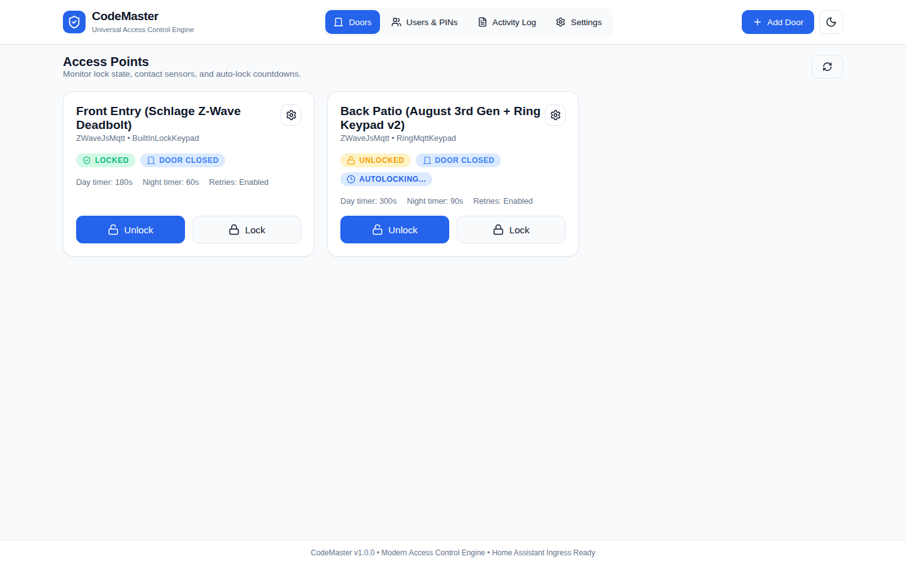
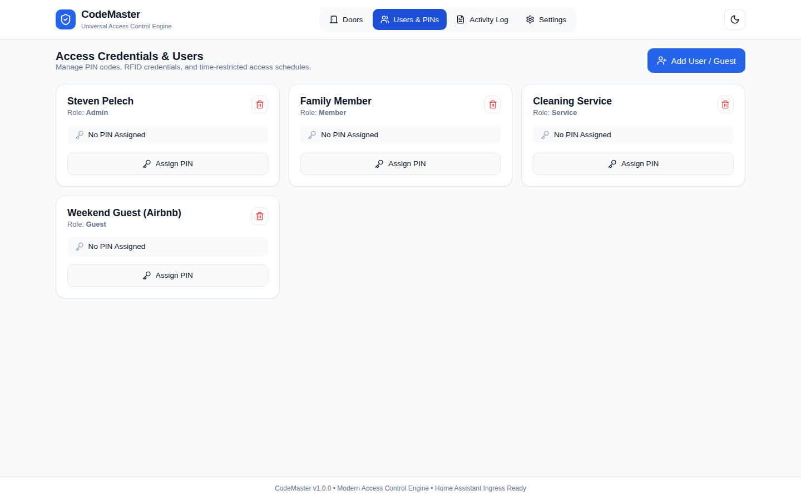
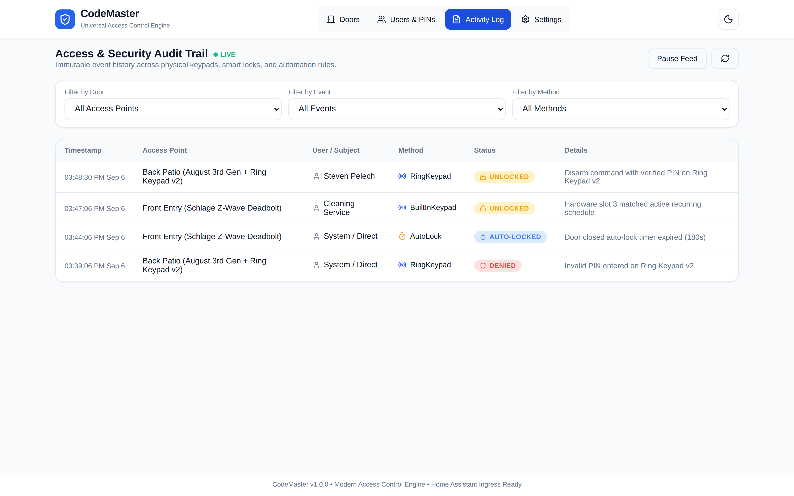
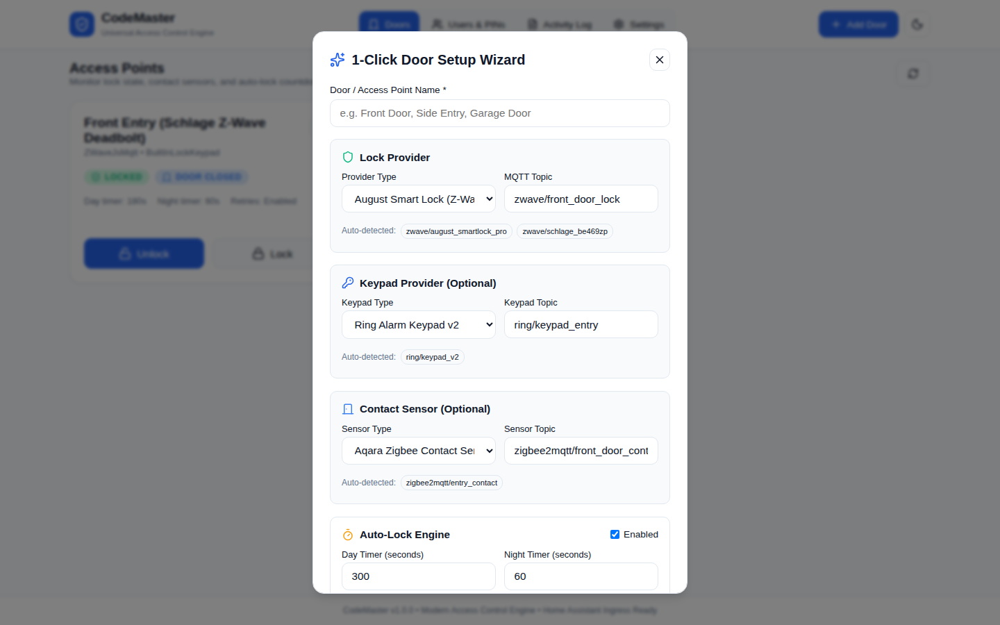
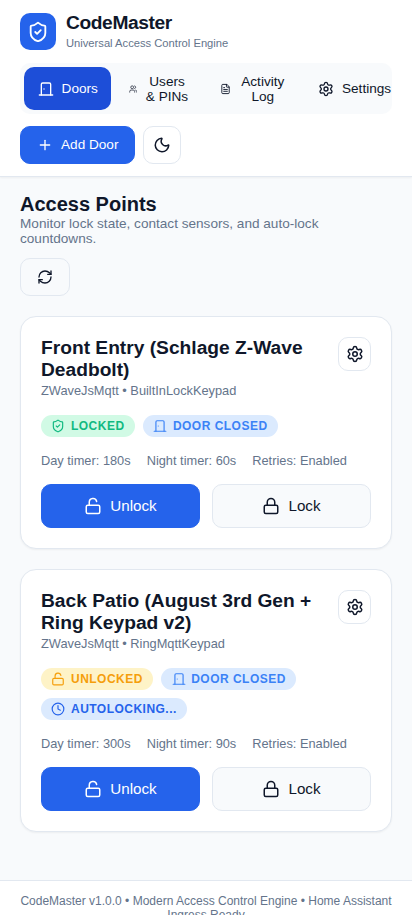
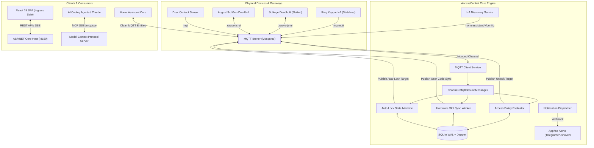

# AccessControl 🔐

[](https://github.com/spelech/AccessControl/actions/workflows/ci.yml)
[](https://github.com/spelech/AccessControl/pkgs/container/accesscontrol)
[](https://github.com/spelech/AccessControl/releases)
[](LICENSE)
[](https://dotnet.microsoft.com/)
[](https://react.dev/)
[](addon/DOCS.md)
[](src/AccessControl.Mcp/)

**AccessControl** is a high-performance, containerized access control and physical lock/keypad synchronization engine for smart homes and homelabs. Designed as an open-source, scalable replacement for Keymaster, it solves Home Assistant entity explosion by externalizing state reconciliation, PIN policy enforcement, and auto-lock logic into an independent engine that communicates over standard MQTT.

---

## 📸 User Interface Showcase

| Access Points & Real-Time Lock Status | User Credentials & Visual Schedules |
|:---:|:---:|
|  |  |

| Live Activity & Security Audit Trail | 1-Click Hardware Setup Wizard | Mobile Responsive UI |
|:---:|:---:|:---:|
|  |  |  |

---

## 💡 Why AccessControl?

### The Keymaster Problem
Traditional Home Assistant lock integrations (such as Keymaster) generate **49 to 50 distinct helper entities for every code slot configured**. For a home with 2 locks and 10 PIN slots, this introduces over **500 synthetic entities** (switches, inputs, sensors, automations) directly into the Home Assistant state machine. This entity bloat causes:
- Database degradation and disk ballooning in SQLite/PostgreSQL.
- Event loop queuing latency that risks tripping Home Assistant's internal event dispatch guard (`_MAX_QUEUED_EVENT_DISPATCHES = 10,000`).
- Sluggish dashboard re-renders and synchronization race conditions.
- Strict hardware coupling that fails completely when using stateless event keypads (like the **Ring Keypad v2**) separated from deadbolts (like the **August Smart Lock**).

### The AccessControl Solution (Frigate-Style Architecture)
AccessControl adopts the architecture proven by **Frigate NVR**: compute-intensive and event-heavy tasks execute within a dedicated, high-speed container, while Home Assistant receives clean, discoverable entities:

- **Zero Entity Bloat**: AccessControl emits only **3 to 4 clean entities per door** via standard Home Assistant MQTT Discovery:
  - `lock.<door_id>` — Fast lock/unlock state & command
  - `binary_sensor.<door_id>_sensor` — Contact sensor mirror
  - `event.<door_id>_access` — Rich security access event stream (`keypad_unlock`, `manual_unlock`, `auto_lock`, `tamper`)
  - `switch.<door_id>_autolock` — Auto-lock enable toggle
- **Universal Provider Abstraction**: Seamlessly bridges stateless event keypads (Ring Keypad v2 via `ring-mqtt`), physical slotted hardware (Schlage Connect, Yale, Kwikset via Z-Wave JS UI), and generic MQTT/ESPHome/Zigbee relays.
- **Microsecond Event Ingestion**: High-throughput `System.Threading.Channels.Channel<MqttInboundMessage>` pipeline with sub-50ms lock dispatch.
- **Embedded SQLite WAL Persistence**: Zero-ORM overhead using high-performance Dapper with Write-Ahead Logging (`PRAGMA journal_mode = WAL;`).
- **AI Agent Tooling (MCP)**: Native Model Context Protocol server implementing the **2026-07-28 specification** at `/mcp/sse`.

---

## 🏛️ System Architecture



---

## 🚀 Quickstart & Deployment

### Option A: Docker Compose (Standalone)

Create a `docker-compose.yaml` file:

```yaml
services:
  accesscontrol:
    image: ghcr.io/spelech/accesscontrol:latest
    container_name: accesscontrol
    restart: unless-stopped
    ports:
      - "8150:8150"
    environment:
      - ASPNETCORE_ENVIRONMENT=Production
      - MQTT__HOST=10.0.0.10
      - MQTT__PORT=1883
      - MQTT__CLIENTID=accesscontrol
      - DATABASE__PATH=/app/data/accesscontrol.db
    volumes:
      - ./data:/app/data
```

Start the container:
```bash
docker compose up -d
```
Access the dashboard at `http://localhost:8150`.

---

### Option B: Home Assistant Add-on (Ingress Ready)

AccessControl can be installed directly as a Home Assistant Add-on with native Ingress support (zero port forwarding required).

1. In Home Assistant, navigate to **Settings > Add-ons > Add-on Store**.
2. Click the three dots in the top right, select **Repositories**, and add:
   ```
   https://github.com/spelech/AccessControl
   ```
3. Locate **AccessControl**, click **Install**, and toggle **Show in sidebar**.
4. Start the add-on and open the AccessControl web UI directly inside Home Assistant!

*See the [Add-on Documentation](addon/DOCS.md) for full configuration details.*

---

## 🔑 Key Features

### 1. Stateless Event Keypads & Slotted Locks
- **Ring Keypad v2 Integration**: AccessControl monitors `ring/<location>/alarm/command` and keypad topics. When a disarm code is entered on the keypad, AccessControl evaluates the credential against active policies in SQLite and dispatches an unlock command to the associated deadbolt in $< 50\text{ ms}$.
- **Hardware Slotted Deadbolts**: For locks supporting hardware slots (e.g., Schlage BE469, Yale Real Living), AccessControl synchronizes active schedules into slots 1–30. Expired guest codes are automatically pruned from the lock's EEPROM.

### 2. Intelligent Auto-Lock State Machine
- **Contact Sensor Awareness**: Auto-lock timers will never throw the deadbolt into the door frame.
- **Paused While Open**: When a door unlocks and opens, the countdown pauses (`PausedDoorOpen`).
- **Counting Down on Close**: The timer arms only once the contact sensor transitions to `Closed`. If reopened mid-countdown, the timer aborts immediately.
- **Day / Night Timer Thresholds**: Configure distinct auto-lock delay intervals (e.g. 5 minutes during the day, 60 seconds at night).
- **Auto-Jam Detection & Retry**: If the lock reports a jam, AccessControl initiates an automated retry sequence before raising a high-priority alert.

### 3. Visual Scheduling Engine
Define flexible access rules with zero YAML:
- **Always Active**: Unrestricted 24/7 access for primary residents.
- **Weekly Recurring**: Day-of-week bitmask selection (M, T, W, Th, F, Sa, Su) combined with precise start/end time windows (e.g. Cleaners on Tue/Thu 09:00–13:00).
- **Date Range**: Set exact start and expiration timestamps (ideal for short-term guests and Airbnb visitors).
- **One-Time Use**: Automatically revokes the PIN credential after a single successful unlock.

---

## 🤖 Model Context Protocol (MCP) Server

AccessControl includes an integrated MCP server adhering strictly to the **2026-07-28 specification** (with automatic fallback to `2024-11-05`), available at `/mcp/sse`. AI coding agents (such as Google Antigravity, Claude, or MCG Router) can dynamically interact with access points:

| Tool Name | Parameters | Description |
|---|---|---|
| `accesscontrol__list_doors` | — | Returns all registered access points, lock capabilities, and current lock/contact states. |
| `accesscontrol__unlock_door` | `door_id` | Remotely commands a deadbolt or strike to unlock. |
| `accesscontrol__lock_door` | `door_id` | Remotely commands a deadbolt to lock. |
| `accesscontrol__create_guest_pin` | `user_name`, `pin`, `door_id`, `valid_from`, `valid_until` | Creates a temporary guest user, encrypts/hashes their PIN, and provisions an active schedule. |
| `accesscontrol__revoke_user` | `user_id` | Deactivates a user and triggers immediate hardware slot code clearing. |
| `accesscontrol__get_access_logs` | `door_id` (optional), `limit` | Queries recent access events, filtering by lock, user, or access method. |

---

## 📡 REST API Reference

| Method | Endpoint | Description |
|---|---|---|
| `GET` | `/api/doors` | List all access points with live lock/contact state. |
| `POST` | `/api/doors` | Register a new access point with lock, keypad, and sensor topics. |
| `PUT` | `/api/doors/{id}` | Update door settings, auto-lock timeouts, and topic bindings. |
| `DELETE` | `/api/doors/{id}` | Remove an access point. |
| `POST` | `/api/doors/{id}/unlock` | Trigger remote unlock. |
| `POST` | `/api/doors/{id}/lock` | Trigger remote lock. |
| `GET` | `/api/users` | List all registered users, credentials, and schedule assignments. |
| `POST` | `/api/users` | Create a user, assign a PIN, and configure access policies. |
| `PUT` | `/api/users/{id}` | Update user details or schedule policies. |
| `DELETE` | `/api/users/{id}` | Delete user and revoke physical slots. |
| `GET` | `/api/logs` | Query paginated access history. |
| `GET` | `/api/logs/stream` | Server-Sent Events (SSE) live activity feed. |
| `GET` | `/api/discovery/mqtt` | List discovered MQTT topics across connected brokers. |
| `GET` | `/health` | Health probe returning `200 OK` (`{"status": "healthy"}`). |

---

## 🧪 Development & Quality Standards

AccessControl enforces Steven T. Pelech's **Agentic Engineering Toolbelt** standards with 100% automated test coverage and layout audits:

```bash
# Build .NET solution
dotnet build AccessControl.slnx --configuration Release

# Run .NET unit & closed-loop controls harness tests (78 tests)
dotnet test AccessControl.slnx --configuration Release

# Run frontend unit tests & zero-warning ESLint audit
cd src/AccessControl.UI
npm test
npm run lint

# Run Playwright Layout Inspector & Touch Ergonomics audit
npx playwright test

# Verify release link integrity & SemVer synchronization
python3 verify_release.py --ci --skip-tests

# Live Docker integration stack (Mosquitto + Hardware Simulator + AccessControl)
docker compose -f docker-compose.test.yaml up -d --build
curl -f http://localhost:8155/health
docker compose -f docker-compose.test.yaml down -v
```

---

## 📄 License

This project is licensed under the **MIT License** - see the [LICENSE](LICENSE) file for details.

Copyright (c) 2026 Steven T. Pelech.
