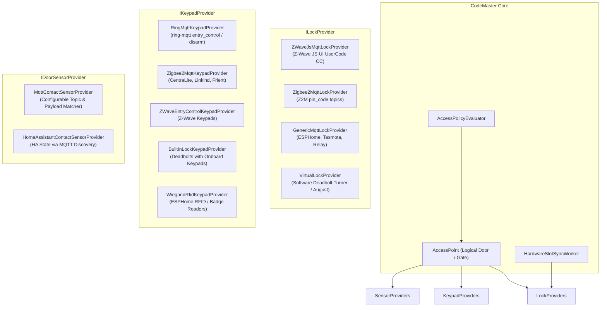
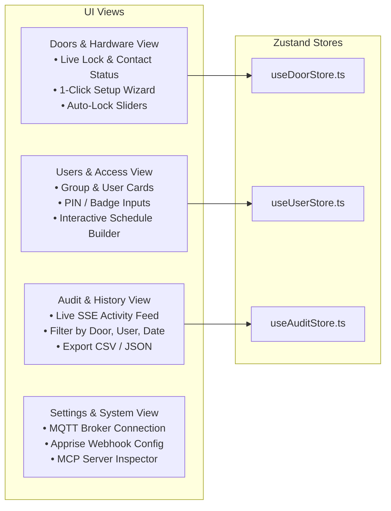
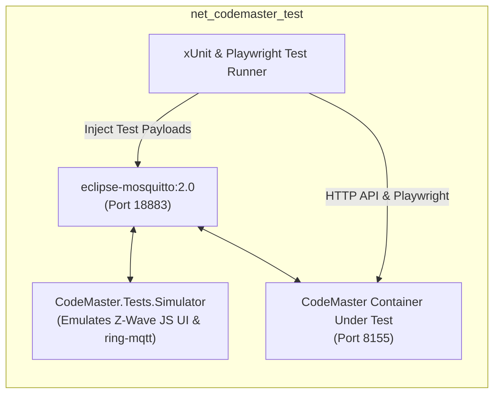

# Design Specification: CodeMaster (v1.0)
## Universal Access Control & Smart Lock/Keypad Synchronization Platform

**Date**: 2026-09-06  
**Status**: Approved for Plan Execution  
**Author**: Steven T. Pelech & Antigravity  
**Repository**: `/containers/dev/codemaster`  
**Target Runtime**: .NET 10 (`net10.0`), React 19, TypeScript (Strict), Vite, SQLite WAL  
**Deployment Targets**: Standalone Docker Container (Primary / First) & Home Assistant Add-on (Phase 2 Packaging)  

---

## 1. Problem Statement & System Vision

### 1.1 The Post-Keymaster Reality
**Keymaster** proved that smart lock code synchronization, recurring schedules, and usage notifications are essential homelab capabilities. However, Keymaster was architected around a flawed assumption: **every single attribute of every code slot was exposed as a discrete Home Assistant entity**. 
- A single 10-slot lock creates **~501 entities** across 9 platforms (`text`, `switch`, `time`, `datetime`, `number`, `binary_sensor`, `sensor`, `button`, `event`).
- Multi-door setups flood Home Assistant with **1,500 to 3,000+ entities**, bloating the recorder database, degrading UI responsiveness, and tripping Home Assistant's core event dispatch safety guard (`_MAX_QUEUED_EVENT_DISPATCHES = 10,000`).
- Keymaster is hardwired for physical locks with built-in keypads. It cannot natively accommodate modern real-world configurations, such as **standalone keypads** (e.g., Ring Keypad, Centralite, Zigbee wall keypads) paired with separate deadbolts (e.g., August, Nuki, magnetic strikes), or RFID/NFC badges.

### 1.2 The CodeMaster Vision
**CodeMaster** is an open-source grade, general-purpose access control platform built on the **Frigate architecture pattern**:
1. **Containerized Core Engine**: All scheduling, hardware slot synchronization, keypad PIN evaluation, auto-lock state machines, and audit logging live inside a high-performance .NET 10 daemon with embedded SQLite WAL.
2. **Dual Deployment Model (Container First, Add-on Ready)**:
   - **Primary (Container First)**: High-performance Docker container running in Docker Compose or Kubernetes, connecting over MQTT to Mosquitto and exposing port `8150`.
   - **Secondary (HAOS / Hass.io Add-on)**: Standard Add-on repository structure (`addon/config.yaml`) with native **Home Assistant Ingress** support (`ingress: true`), auto-negotiating the Supervisor MQTT broker.
3. **100% UI-Driven Configuration**: End users **never touch code or YAML**. Everything—adding doors, pairing keypads, discovering MQTT topics, setting schedules, and managing users—is configured via a modern React 19 web dashboard (accessible standalone or embedded in Home Assistant via Ingress).
4. **Pluggable, Provider-Agnostic Abstraction**: Supports any lock, any keypad, and any contact sensor across Z-Wave, Zigbee, Ring, Matter, ESPHome, and Home Assistant via capability-based interfaces.
5. **Lightweight Home Assistant Footprint**: Exposes **3–4 clean entities per door** via standard HA MQTT Discovery (reducing entity bloat by **>98%**) while firing rich events for instant mobile push notifications.

---

## 2. Core Architectural Tenets & Guarantees

Aligned with the [`AgenticEngineeringToolbelt`](file:///containers/dev/AgenticEngineeringToolbelt):
1. **.NET 10 High-Performance Engine**: Built on `net10.0` with strict nullability (`<Nullable>enable</Nullable>`), `Directory.Build.props`, and `.slnx` solution format.
2. **Relational Persistence (SQLite WAL + Dapper)**: Embedded database with Write-Ahead Logging (`PRAGMA journal_mode = WAL;`) and zero external server dependencies. Queries use Dapper with parameterized scripts and an idempotent `DatabaseSeederService`.
3. **Decoupled Producer-Consumer Pipeline**: Inbound MQTT messages stream into `System.Threading.Channels.Channel<MqttInboundMessage>`, isolating transport I/O from policy evaluation.
4. **Controls & Simulation Mindset**: Every subsystem is validated through automated test harnesses with synthetic MQTT broker loopbacks and an isolated live Docker test stack (`docker-compose.test.yaml`).
5. **Zero Entity Bloat in Home Assistant**: Emits standard Home Assistant MQTT Discovery payloads for **3–4 entities per door** (1 lock proxy, 1 `EventEntity`, 1 door contact sensor, 1 auto-lock toggle switch).
6. **Dual Notification Dispatch**: Pushes rich events to Home Assistant (`event.<door>_access`) for automations and mobile alerts, plus direct webhooks to the local Apprise container (`apprise.wileyriley.com`).
7. **Model Context Protocol (MCP Server First)**: Exposes native MCP endpoints (`/mcp` and `/sse`) allowing AI coding agents and local assistants to inspect locks and provision codes programmatically.

---

## 3. Pluggable Provider Architecture

CodeMaster abstracts physical hardware using capability-driven interfaces registered in .NET's dependency injection container. End users simply select the provider type from a dropdown in the UI.



### 3.1 Provider Interfaces & Capabilities

#### `ILockProvider`
```csharp
public interface ILockProvider
{
    string ProviderType { get; }
    LockCapabilities Capabilities { get; }
    Task<LockState> GetStateAsync(AccessPoint door, CancellationToken ct);
    Task<bool> LockAsync(AccessPoint door, CancellationToken ct);
    Task<bool> UnlockAsync(AccessPoint door, CancellationToken ct);
    Task<IReadOnlyList<HardwareSlotDto>> GetSlotCodesAsync(AccessPoint door, CancellationToken ct);
    Task<bool> SetSlotCodeAsync(AccessPoint door, int slot, string pin, string name, CancellationToken ct);
    Task<bool> ClearSlotCodeAsync(AccessPoint door, int slot, CancellationToken ct);
}

[Flags]
public enum LockCapabilities
{
    None = 0,
    SupportsHardwareSlots = 1 << 0,  // Schlage, Yale, Kwikset with onboard memory
    SupportsRemoteLock = 1 << 1,     // Can be locked remotely
    SupportsRemoteUnlock = 1 << 2,   // Can be unlocked remotely
    SupportsJammedReport = 1 << 3,   // Reports mechanical jam
    SupportsBatteryLevel = 1 << 4    // Reports battery state
}
```

#### `IKeypadProvider`
```csharp
public interface IKeypadProvider
{
    string ProviderType { get; }
    KeypadCapabilities Capabilities { get; }
    KeypadMode Mode { get; } // StatelessEvent (Ring) vs HardwareSlotted (Built-in)
    Task<bool> InitializeAsync(AccessPoint door, CancellationToken ct);
    bool TryParseKeypadEvent(MqttInboundMessage message, out KeypadEventDto? keypadEvent);
}

[Flags]
public enum KeypadCapabilities
{
    None = 0,
    SupportsPin = 1 << 0,
    SupportsBadges = 1 << 1,         // RFID / NFC cards
    SupportsArmModes = 1 << 2,       // Disarm, Home, Away buttons
    SupportsDuressPin = 1 << 3       // Silent duress alarm code
}
```

#### `IDoorSensorProvider`
```csharp
public interface IDoorSensorProvider
{
    string ProviderType { get; }
    Task<bool> InitializeAsync(AccessPoint door, CancellationToken ct);
    bool TryParseContactEvent(MqttInboundMessage message, AccessPoint door, out DoorContactState? state);
}

public enum DoorContactState
{
    Closed,
    Open
}
```

---

## 4. Relational Data Model (SQLite WAL)

```sql
PRAGMA journal_mode = WAL;
PRAGMA synchronous = NORMAL;
PRAGMA busy_timeout = 5000;
PRAGMA foreign_keys = ON;

-- 1. Users & Groups
CREATE TABLE IF NOT EXISTS UserGroups (
    Id TEXT PRIMARY KEY,
    Name TEXT NOT NULL,               -- e.g. 'Family', 'Cleaners', 'Contractors', 'Guests'
    Description TEXT,
    CreatedAt TEXT NOT NULL
);

CREATE TABLE IF NOT EXISTS Users (
    Id TEXT PRIMARY KEY,
    GroupId TEXT,
    Name TEXT NOT NULL,
    Role TEXT NOT NULL DEFAULT 'Member', -- 'Admin', 'Member', 'Guest', 'Service'
    IsActive INTEGER NOT NULL DEFAULT 1,
    CreatedAt TEXT NOT NULL,
    UpdatedAt TEXT NOT NULL,
    FOREIGN KEY(GroupId) REFERENCES UserGroups(Id) ON DELETE SET NULL
);

-- 2. Polymorphic Credentials (PIN, RFID, Badge)
CREATE TABLE IF NOT EXISTS Credentials (
    Id TEXT PRIMARY KEY,
    UserId TEXT NOT NULL,
    Type TEXT NOT NULL DEFAULT 'PIN', -- 'PIN', 'RFID', 'NFC', 'Badge', 'DuressPIN'
    EncryptedValue TEXT NOT NULL,     -- Encrypted PIN (for hardware slot sync)
    HashedValue TEXT NOT NULL,        -- Salted hash (for stateless keypad verification)
    PinLength INTEGER NOT NULL,
    Label TEXT,                       -- e.g. 'Primary PIN', 'Blue Keyfob'
    CreatedAt TEXT NOT NULL,
    FOREIGN KEY(UserId) REFERENCES Users(Id) ON DELETE CASCADE
);

-- 3. Access Points (Logical Doors / Gates / Garage)
CREATE TABLE IF NOT EXISTS AccessPoints (
    Id TEXT PRIMARY KEY,
    Name TEXT NOT NULL,               -- e.g. 'Front Door', 'Side Door', 'Workshop Gate'
    LockProviderType TEXT NOT NULL,   -- 'ZWaveJsMqtt', 'Zigbee2Mqtt', 'GenericMqtt', 'Virtual'
    LockConfigJson TEXT NOT NULL,     -- Provider-specific JSON (topics, node IDs, etc.)
    KeypadProviderType TEXT NOT NULL, -- 'BuiltIn', 'RingMqtt', 'Zigbee2Mqtt', 'Wiegand', 'None'
    KeypadConfigJson TEXT,            -- Provider-specific JSON (topics, mode, etc.)
    DoorSensorProviderType TEXT,      -- 'MqttContact', 'HomeAssistant', 'None'
    DoorSensorConfigJson TEXT,        -- Config (topic, payload_open, payload_closed, invert)
    AutoLockEnabled INTEGER NOT NULL DEFAULT 1,
    AutoLockDaySeconds INTEGER NOT NULL DEFAULT 300,
    AutoLockNightSeconds INTEGER NOT NULL DEFAULT 60,
    RetryOnFailure INTEGER NOT NULL DEFAULT 1,
    CreatedAt TEXT NOT NULL,
    UpdatedAt TEXT NOT NULL
);

-- 4. Access Policies & Schedules
CREATE TABLE IF NOT EXISTS AccessPolicies (
    Id TEXT PRIMARY KEY,
    Name TEXT NOT NULL,               -- e.g. 'Always 24/7', 'Weekdays 9-5', 'Weekend Guest'
    ScheduleType TEXT NOT NULL,       -- 'Always', 'WeeklyRecurring', 'DateRange', 'OneTime'
    DaysOfWeek INTEGER NOT NULL DEFAULT 127, -- Bitmask: 1=Mon, 2=Tue, 4=Wed, 8=Thu, 16=Fri, 32=Sat, 64=Sun
    StartTime TEXT,                   -- 'HH:mm:ss'
    EndTime TEXT,                     -- 'HH:mm:ss'
    ValidFrom TEXT,                   -- ISO8601 UTC
    ValidUntil TEXT,                  -- ISO8601 UTC
    RemainingUses INTEGER,            -- Decremented on unlock for OneTime schedules
    IsEnabled INTEGER NOT NULL DEFAULT 1
);

-- 5. Access Assignments (User or Group <-> AccessPoint <-> Policy)
CREATE TABLE IF NOT EXISTS AccessAssignments (
    Id TEXT PRIMARY KEY,
    AccessPointId TEXT NOT NULL,
    UserId TEXT,                      -- Specific user, OR...
    GroupId TEXT,                     -- Entire group
    PolicyId TEXT NOT NULL,
    FOREIGN KEY(AccessPointId) REFERENCES AccessPoints(Id) ON DELETE CASCADE,
    FOREIGN KEY(UserId) REFERENCES Users(Id) ON DELETE CASCADE,
    FOREIGN KEY(GroupId) REFERENCES UserGroups(Id) ON DELETE CASCADE,
    FOREIGN KEY(PolicyId) REFERENCES AccessPolicies(Id) ON DELETE CASCADE
);

-- 6. Hardware Slots (For slotted locks like Schlage, Yale, Kwikset)
CREATE TABLE IF NOT EXISTS HardwareSlots (
    Id TEXT PRIMARY KEY,
    AccessPointId TEXT NOT NULL,
    SlotNumber INTEGER NOT NULL,
    UserId TEXT,
    CredentialId TEXT,
    SyncStatus TEXT NOT NULL,         -- 'Synced', 'Adding', 'Deleting', 'Error'
    LastSyncedAt TEXT,
    FOREIGN KEY(AccessPointId) REFERENCES AccessPoints(Id) ON DELETE CASCADE,
    FOREIGN KEY(UserId) REFERENCES Users(Id) ON DELETE SET NULL,
    FOREIGN KEY(CredentialId) REFERENCES Credentials(Id) ON DELETE SET NULL,
    UNIQUE(AccessPointId, SlotNumber)
);

-- 7. Audit Trail & Access Logs
CREATE TABLE IF NOT EXISTS AccessLogs (
    Id TEXT PRIMARY KEY,
    AccessPointId TEXT NOT NULL,
    UserId TEXT,
    UserName TEXT NOT NULL,
    CredentialType TEXT NOT NULL,     -- 'PIN', 'Badge', 'Manual', 'Auto'
    EventType TEXT NOT NULL,          -- 'Unlocked', 'Locked', 'Denied', 'Jammed', 'AutoLocked'
    Method TEXT NOT NULL,             -- 'RingKeypad', 'BuiltInKeypad', 'ZWaveKeypad', 'Manual', 'RF', 'AutoLock'
    Timestamp TEXT NOT NULL,
    Details TEXT,
    FOREIGN KEY(AccessPointId) REFERENCES AccessPoints(Id) ON DELETE CASCADE
);

CREATE INDEX IF NOT EXISTS idx_access_logs_point_time ON AccessLogs(AccessPointId, Timestamp DESC);
CREATE INDEX IF NOT EXISTS idx_assignments_point ON AccessAssignments(AccessPointId);
```

---

## 5. Deployment Architecture: Container-First & Hass.io Add-on Ready

### 5.1 Mode 1: Standalone Container (Primary / Phase 1)
- Delivered as a standard Docker image (`codemaster:latest`).
- Run via Docker Compose:
  ```yaml
  services:
    codemaster:
      image: codemaster:latest
      container_name: codemaster
      restart: unless-stopped
      environment:
        - MQTT__Host=mosquitto
        - MQTT__Port=1883
        - MQTT__Username=${MQTT_USER}
        - MQTT__Password=${MQTT_PASS}
        - Storage__DatabasePath=/app/data/codemaster.db
        - Apprise__Url=http://10.0.0.10:8000/notify/apprise
      volumes:
        - /containers/smarthome_support/codemaster/data:/app/data
      ports:
        - "8150:8150"
      networks:
        - net_smarthome
  ```

### 5.2 Mode 2: Home Assistant Add-on (Phase 2 Packaging)
- Built on top of the exact same underlying Docker image.
- Add-on packaging structure:
  ```text
  addon/
  ├── config.yaml          # Add-on metadata, arch (amd64, aarch64), ingress: true
  ├── build.yaml           # Multi-arch base images
  ├── rootfs/
  │   └── etc/services.d/  # S6 overlay / startup script reading /data/options.json
  └── DOCS.md
  ```
- **Ingress Support Contract**:
  - The ASP.NET Core host and React SPA dynamically support `X-Ingress-Path` header rewriting:
    - Vite configured with relative asset URLs (`base: './'`).
    - API requests in `apiClient.ts` read `window.__CODEMASTER_BASE_PATH__` (populated from `<meta name="base-path">` or document URI).
  - This guarantees the exact same image works whether accessed directly at `http://host:8150/` or proxied through Home Assistant's Ingress at `https://homeassistant.local/api/hassio_ingress/<token>/`.

---

## 6. End-to-End Operational Flows

### 6.1 Real-World Setup A: Standalone Keypad + Separate Lock (August + Ring Keypad)
1. User enters PIN `4821` + `Disarm` on the Ring Keypad outside.
2. `ring-mqtt` publishes the event to `ring/<location>/alarm/command` (or keypad state topic).
3. `MqttInboundWorker` ingests the packet into `Channel<MqttInboundMessage>`.
4. `AccessPolicyEvaluator` matches the topic to the `AccessPoint`:
   - Retrieves active `AccessAssignments` for that door.
   - Evaluates schedules (current time within window, day bitmask matches, `RemainingUses > 0`).
   - Verifies the entered PIN against `Credentials.HashedValue`.
5. **Action Dispatch**:
   - Executes `ILockProvider.UnlockAsync(AugustLock)` $\to$ publishes unlock command to Z-Wave JS UI topic `zwave/side_door/door_lock/endpoint_0/targetState/set` = `false`.
   - Records success in `AccessLogs` with user name and timestamp.
   - Dispatches Home Assistant event via MQTT (`event.side_door_access`).
   - Posts webhook alert to Apprise (`apprise.wileyriley.com`) $\to$ *"Steve unlocked Side Door via Ring Keypad"*.

### 6.2 Real-World Setup B: Lock with Built-In Keypad (Schlage Deadbolt)
1. In the Web UI, the user assigns *"Cleaner"* (PIN `9182`, active Wed 9am-1pm) to the Front Door.
2. `HardwareSlotSyncWorker` allocates an available hardware slot (e.g. Slot 3) on the Schlage lock.
3. Invokes `ILockProvider.SetSlotCodeAsync()` $\to$ publishes Z-Wave UserCode CC command to `zwave/front_door/user_code/endpoint_0/set`.
4. The lock writes the PIN to onboard NVRAM and acknowledges the write; CodeMaster marks Slot 3 as `Synced`.
5. When the Cleaner types `9182` on the physical Schlage keypad, the deadbolt unlocks itself locally and broadcasts an Access Control notification (`alarm_type: 19, slot: 3`).
6. `MqttInboundWorker` matches Slot 3 $\to$ Cleaner $\to$ records `AccessLogs` and fires notifications.
7. When Wednesday 1:00 PM passes, `HardwareSlotSyncWorker` detects the expired schedule, invokes `ClearSlotCodeAsync(Slot 3)`, and wipes the code from the physical lock.

### 6.3 Universal Auto-Lock Engine with Door Sensor Intelligence
- **Trigger**: Lock transitions to `unlocked` (by any method: keypad, manual turn, or RF).
- **Contact Check**: Queries the configured `IDoorSensorProvider`:
  - If the door is **Open**: Auto-lock countdown is suspended. UI displays an amber badge: *"Auto-Lock paused: Door is open"*.
  - When the door transitions to **Closed**: Auto-lock countdown arms (Day delay e.g., 300s, or Night delay e.g., 60s).
  - If the door is opened while counting down: Timer immediately cancels.
  - When the timer reaches 0: CodeMaster issues `ILockProvider.LockAsync()`.
- **Jam & Retry Handling**: If the lock reports `jammed` or does not report `locked` within 15 seconds:
  - If `RetryOnFailure == true`: Issues a secondary lock attempt after a 5-second backoff.
  - If failure persists: Dispatches an urgent `Lock Jammed` alert to Home Assistant and Apprise.

---

## 7. Frontend Architecture & 100% UI-Driven UX

Built with **React 19 + TypeScript (strict) + Zustand + Vite** and pure CSS custom properties (`theme.css`).



### 7.1 Interactive UI Wizards (Zero YAML / Zero Code for Users)
1. **Add/Edit Door Wizard**:
   - Step 1: Door Name (e.g. *"Front Door"*).
   - Step 2: Lock Type dropdown (`Z-Wave JS UI`, `Zigbee2MQTT`, `Generic MQTT`, `Virtual Deadbolt`).
     - Includes **MQTT Topic Auto-Detector**: Listens to Mosquitto and provides a clickable list of detected lock entities.
   - Step 3: Keypad Type dropdown (`Built-in Keypad`, `Ring Keypad`, `Zigbee Keypad`, `None`).
   - Step 4: Door Contact Sensor dropdown (auto-populated with discovered contact sensors).
   - Step 5: Auto-Lock sliders (Day seconds, Night seconds, Retry toggle).
2. **Interactive Schedule Builder**:
   - Visual schedule mode toggle:
     - **24/7 Always Active**: 1-click toggle.
     - **Recurring Days & Times**: Clickable weekday pills (`M`, `T`, `W`, `Th`, `F`, `Sa`, `Su`) + interactive dual-thumb time range sliders.
     - **Date Range**: Visual calendar date-picker for guests or vacation rentals.
     - **One-Time Use**: Automatically revokes after 1 successful unlock.
3. **Door Assignment Matrix**:
   - Checkbox matrix allowing an administrator to grant a user or group access to any door with a single click.

---

## 8. Home Assistant Integration (The Frigate Pattern)

CodeMaster communicates with Home Assistant via standard **HA MQTT Discovery**, requiring zero custom integration install for basic operation:
For each configured `AccessPoint`:
1. `lock.<door_id>`: Clean lock control (proxies or reflects the lock state).
2. `event.<door_id>_access`: Standard HA `EventEntity` (introduced in HA 2023.8). When unlocked, it records event type `keypad_unlock` with rich attributes:
   ```json
   {
     "user": "Steve",
     "method": "RingKeypad",
     "credential_type": "PIN",
     "access_point": "Side Door",
     "timestamp": "2026-09-06T00:15:00Z"
   }
   ```
3. `binary_sensor.<door_id>_door_sensor`: Contact state (mirrored from the door sensor).
4. `switch.<door_id>_autolock`: Toggle to enable/disable auto-lock rules directly from HA dashboards.

**Total Entities per Door**: **3 to 4** (compared to Keymaster's 501 entities per lock!).

---

## 9. Model Context Protocol (MCP) Server Integration

Following Tenet 9, CodeMaster exposes an integrated MCP server at `/mcp/sse`:
| Tool Name | Parameters | Description |
| :--- | :--- | :--- |
| `codemaster__list_doors` | None | Returns real-time status of all access points (lock state, contact state, auto-lock state). |
| `codemaster__unlock_door` | `doorId: string`, `durationMinutes?: number` | Unlocks an access point with optional auto-lock override. |
| `codemaster__lock_door` | `doorId: string` | Immediately locks an access point. |
| `codemaster__create_guest_pin` | `name: string`, `pin: string`, `validFrom: string`, `validUntil: string`, `doorIds: string[]` | Provisions a temporary guest PIN valid for a specific window across selected doors. |
| `codemaster__revoke_user` | `userId: string` | Deactivates a user and immediately clears hardware slots across all locks. |
| `codemaster__get_access_logs` | `doorId?: string`, `limit?: number` | Retrieves recent access logs with timestamps, user names, and methods. |

---

## 10. Docker Stack for Live Integration Testing

A dedicated test environment (`docker-compose.test.yaml`) enables continuous automated integration testing without physical hardware:



### Verification Capabilities:
1. **End-to-End Keypad $\to$ Lock Actuation**: Simulator injects Ring Keypad PIN $\to$ validates August lock command received on test broker within <50ms.
2. **Hardware Slot Allocation & Revocation**: Adds user $\to$ verifies Z-Wave UserCode CC topic receives set command $\to$ expires user $\to$ verifies clear command.
3. **Auto-Lock State Machine Under Door Disturbance**: Simulates door open while unlocked $\to$ validates timer paused $\to$ door closed $\to$ timer countdown $\to$ lock command issued.
4. **Playwright 4-Point Layout Audit**:
   - `toHaveNoLayoutOverflow()`: Zero horizontal scroll on mobile viewports.
   - `toHaveMobileFit()`: Responsive layout scaling.
   - `toHaveTouchFriendlyTargets({ minSize: 24 })`: Ergonomic touch targets.
   - `toPassLayoutAudit({ minScore: 85 })`: Composite UI/UX score.

---

## 11. Solution Layout & File Structure

```text
/containers/dev/codemaster/
├── codemaster.slnx                  # .NET 10 solution file
├── Directory.Build.props            # Compiler standards & warnings
├── Dockerfile                       # Multi-stage production container build
├── docker-compose.yaml              # Production compose service definition
├── docker-compose.test.yaml         # Live integration testing stack
├── commit.sh                        # Atomic commit and version buster script
├── verify_release.py                # Release auditor and markdown link checker
├── ARCHITECTURE.md                  # Living documentation with Mermaid topologies
├── addon/                           # Hass.io Add-on packaging (Phase 2)
│   ├── config.yaml
│   └── build.yaml
├── docs/
│   └── superpowers/specs/
│       └── 2026-09-06-codemaster-design.md
├── src/
│   ├── CodeMaster.Core/             # Entities, Enums, Interfaces (ILockProvider, IKeypadProvider, etc.)
│   ├── CodeMaster.Data/             # SQLite connection factory, Dapper scripts
│   │   ├── DatabaseSeederService.cs # Idempotent schema migrations
│   │   └── Scripts/                 # .sql stored procedures
│   ├── CodeMaster.Engine/           # MQTT worker, Channels, Auto-lock engine, Providers
│   │   ├── Channels/                # MqttInboundMessage channel
│   │   ├── Mqtt/                    # MQTTnet client & topic dispatchers
│   │   ├── Providers/               # Lock, Keypad, and Sensor provider implementations
│   │   └── Services/                # AccessPointService, PinValidator, NotificationDispatcher
│   ├── CodeMaster.Mcp/              # MCP server implementation & tool definitions
│   ├── CodeMaster.Web/              # ASP.NET Core host, Controllers, /health probe
│   │   └── Controllers/             # AccessPointsController, UsersController, LogsController
│   └── CodeMaster.UI/               # React 19 + TypeScript + Zustand + Vite SPA
│       ├── src/
│       ├── package.json
│       └── vite.config.ts
└── tests/
    ├── CodeMaster.Tests.Unit/       # Fast xUnit unit tests
    ├── CodeMaster.Tests.Harness/    # Mock MQTT in-memory harness
    ├── CodeMaster.Tests.Simulator/  # Mock hardware simulator for live docker stack
    └── CodeMaster.UI.Tests/         # Playwright Layout Inspector suite
```

---

## 12. Spec Self-Review Checklist
- [x] **Placeholder Scan**: No "TBD" or "TODO" markers present.
- [x] **Dual Deployment Model**: Container-first delivery specified with explicit Hass.io add-on packaging and Ingress base path handling.
- [x] **Internal Consistency**: Provider abstraction cleanly isolates lock, keypad, and sensor implementations while fully covering Schlage, August, and Ring Keypad via configuration.
- [x] **Zero Code/YAML for Users**: All device pairing, schedules, and user management are strictly UI-driven.
- [x] **Scope Check**: Tightly scoped to access control, multi-protocol synchronization, auto-lock, notifications, and lightweight HA integration.
- [x] **Ambiguity Check**: Relational schema, provider interfaces, MQTT pipelines, and testing stacks are fully articulated.
