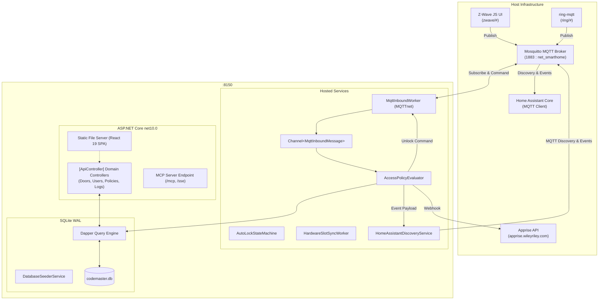

# Design Specification: CodeMaster (v1.0)

**Date**: 2026-09-06  
**Status**: Draft (Approved for Spec Review)  
**Author**: Steven T. Pelech & Antigravity  
**Repository**: `/containers/dev/codemaster`  
**Target Runtime**: .NET 10 (`net10.0`), React 19, TypeScript (Strict), Vite, SQLite WAL  

---

## 1. Problem Statement & Background

**Keymaster** is a Home Assistant custom component for managing user codes and access schedules across smart locks. While functionally rich (handling PIN syncing, schedules, and usage notifications), Keymaster suffers from a critical structural failure:
1. **Entity Explosion**: Keymaster models every slot attribute, schedule limit, time picker, and toggle as an individual Home Assistant entity, creating **49–50 entities per code slot** and **~501 entities for a single 10-slot lock**.
2. **HA Safety Violations**: In Home Assistant 2026.7+, this massive entity graph caused updates to exceed the core event queue limit (`_MAX_QUEUED_EVENT_DISPATCHES = 10,000`), forcing complex, fragile deferred event batching.
3. **Keypad Mismatch**: Keymaster assumes every device is a physical lock with on-device slot storage. It cannot cleanly model modern setups such as an **August lock paired with an external Ring Keypad**, where a standalone keypad transmits entered PINs to unlock a separate deadbolt.

**CodeMaster** replaces this paradigm by following the **Frigate architecture**: heavy business logic, hardware sync, schedules, and access logs live in a self-contained, high-performance Docker container. Home Assistant receives only clean, lightweight event entities (reducing entity overhead by >98%).

---

## 2. Core Architectural Tenets & Guarantees

Aligned with the [`AgenticEngineeringToolbelt`](file:///containers/dev/AgenticEngineeringToolbelt):
1. **.NET 10 High-Performance Engine**: Built on `net10.0` with strict nullability (`<Nullable>enable</Nullable>`), `Directory.Build.props`, and `.slnx` solution format.
2. **Relational Persistence (SQLite WAL + Dapper)**: Embedded database with Write-Ahead Logging (`PRAGMA journal_mode = WAL;`) and zero external server dependencies. Queries use Dapper with parameterized scripts and an idempotent `DatabaseSeederService`.
3. **Decoupled Producer-Consumer Pipeline**: Inbound MQTT messages stream into `System.Threading.Channels.Channel<MqttInboundMessage>`, isolating transport I/O from policy evaluation.
4. **Controls & Simulation Mindset**: Every subsystem is validated through automated test harnesses with synthetic MQTT broker loopbacks and an isolated live Docker test stack.
5. **Zero Entity Bloat in Home Assistant**: Emits standard Home Assistant MQTT Discovery payloads for **3–4 entities per door** (1 lock proxy, 1 `EventEntity`, 1 door contact sensor, 1 auto-lock toggle switch).
6. **Dual Notification Dispatch**: Pushes rich events to Home Assistant (`event.<door>_access`) for automations and mobile alerts, plus direct webhooks to the local Apprise container (`apprise.wileyriley.com`).
7. **Model Context Protocol (MCP Server First)**: Exposes native MCP endpoints (`/mcp` and `/sse`) allowing AI coding agents and local assistants to inspect locks and provision codes programmatically.

---

## 3. System Architecture & Topology



---

## 4. Relational Data Model (SQLite WAL)

### 4.1 Schema Definition
All tables are created idempotently via `DatabaseSeederService.cs` during application bootstrap:

```sql
PRAGMA journal_mode = WAL;
PRAGMA synchronous = NORMAL;
PRAGMA busy_timeout = 5000;
PRAGMA foreign_keys = ON;

CREATE TABLE IF NOT EXISTS Users (
    Id TEXT PRIMARY KEY,
    Name TEXT NOT NULL,
    Role TEXT NOT NULL DEFAULT 'Member', -- Admin, Member, Guest, Service
    IsActive INTEGER NOT NULL DEFAULT 1,
    CreatedAt TEXT NOT NULL,
    UpdatedAt TEXT NOT NULL
);

CREATE TABLE IF NOT EXISTS Credentials (
    Id TEXT PRIMARY KEY,
    UserId TEXT NOT NULL,
    Type TEXT NOT NULL DEFAULT 'PIN', -- PIN, RFID, Badge
    PinHash TEXT NOT NULL,            -- Salted hash or AES-GCM encrypted for sync
    PinLength INTEGER NOT NULL,
    CreatedAt TEXT NOT NULL,
    FOREIGN KEY(UserId) REFERENCES Users(Id) ON DELETE CASCADE
);

CREATE TABLE IF NOT EXISTS AccessPoints (
    Id TEXT PRIMARY KEY,
    Name TEXT NOT NULL,               -- e.g., 'Front Door', 'Side Door'
    LockType TEXT NOT NULL,           -- 'ZWave', 'Zigbee', 'Virtual'
    LockMqttTopic TEXT NOT NULL,      -- e.g., 'zwave/front_door'
    KeypadType TEXT NOT NULL,         -- 'BuiltIn', 'RingMqtt', 'Zigbee', 'None'
    KeypadMqttTopic TEXT,             -- e.g., 'ring/location/keypad'
    DoorSensorMqttTopic TEXT,         -- e.g., 'ring/location/contact_sensor'
    DoorSensorInvert INTEGER NOT NULL DEFAULT 0,
    AutoLockEnabled INTEGER NOT NULL DEFAULT 1,
    AutoLockDaySeconds INTEGER NOT NULL DEFAULT 300,
    AutoLockNightSeconds INTEGER NOT NULL DEFAULT 60,
    RetryOnFailure INTEGER NOT NULL DEFAULT 1,
    CreatedAt TEXT NOT NULL,
    UpdatedAt TEXT NOT NULL
);

CREATE TABLE IF NOT EXISTS AccessPolicies (
    Id TEXT PRIMARY KEY,
    UserId TEXT NOT NULL,
    AccessPointId TEXT NOT NULL,
    ScheduleType TEXT NOT NULL,       -- 'Always', 'WeeklyRecurring', 'DateRange', 'OneTime'
    DaysOfWeek INTEGER NOT NULL DEFAULT 127, -- Bitmask: 1=Mon, 2=Tue, 4=Wed, 8=Thu, 16=Fri, 32=Sat, 64=Sun
    StartTime TEXT,                   -- 'HH:mm:ss'
    EndTime TEXT,                     -- 'HH:mm:ss'
    ValidFrom TEXT,                   -- ISO8601 UTC
    ValidUntil TEXT,                  -- ISO8601 UTC
    RemainingUses INTEGER,            -- Nullable, decremented on valid unlock
    IsEnabled INTEGER NOT NULL DEFAULT 1,
    FOREIGN KEY(UserId) REFERENCES Users(Id) ON DELETE CASCADE,
    FOREIGN KEY(AccessPointId) REFERENCES AccessPoints(Id) ON DELETE CASCADE
);

CREATE TABLE IF NOT EXISTS HardwareSlots (
    Id TEXT PRIMARY KEY,
    AccessPointId TEXT NOT NULL,
    SlotNumber INTEGER NOT NULL,
    UserId TEXT,                      -- Null if vacant
    PinCode TEXT,                     -- Encrypted PIN written to hardware
    SyncStatus TEXT NOT NULL,         -- 'Synced', 'Adding', 'Deleting', 'Error'
    LastSyncedAt TEXT,
    FOREIGN KEY(AccessPointId) REFERENCES AccessPoints(Id) ON DELETE CASCADE,
    FOREIGN KEY(UserId) REFERENCES Users(Id) ON DELETE SET NULL,
    UNIQUE(AccessPointId, SlotNumber)
);

CREATE TABLE IF NOT EXISTS AccessLogs (
    Id TEXT PRIMARY KEY,
    AccessPointId TEXT NOT NULL,
    UserId TEXT,
    UserName TEXT NOT NULL,
    EventType TEXT NOT NULL,          -- 'Unlocked', 'Locked', 'Denied', 'Jammed', 'AutoLocked'
    Method TEXT NOT NULL,             -- 'RingKeypad', 'BuiltInKeypad', 'Manual', 'RF', 'AutoLock'
    Timestamp TEXT NOT NULL,
    Details TEXT,
    FOREIGN KEY(AccessPointId) REFERENCES AccessPoints(Id) ON DELETE CASCADE
);

CREATE INDEX IF NOT EXISTS idx_access_logs_point_time ON AccessLogs(AccessPointId, Timestamp DESC);
CREATE INDEX IF NOT EXISTS idx_access_policies_user_point ON AccessPolicies(UserId, AccessPointId);
```

---

## 5. Subsystems & Data Flow

### 5.1 The Ring Keypad & August Lock Pipeline
1. The user approaches the Side Door and enters PIN `4821` + `Disarm` on the Ring Keypad.
2. `ring-mqtt` detects the event and publishes to `ring/<loc>/alarm/command` (or keypad state topic) with payload `{"command": "disarm", "code": "4821"}`.
3. `MqttInboundWorker` ingests the payload, constructs an `MqttInboundMessage`, and enqueues it into `Channel<MqttInboundMessage>`.
4. `AccessPolicyEvaluator` dequeues the message:
   - Matches the topic to the Side Door `AccessPoint`.
   - Queries `AccessPolicies` for users assigned to the Side Door.
   - Computes active state (current time within `StartTime`/`EndTime`, day matches bitmask, within date window, `RemainingUses > 0`).
   - Verifies PIN hash against `Credentials`.
5. **If Valid**:
   - Publishes Z-Wave unlock payload to August Lock topic: `zwave/side_door/door_lock/endpoint_0/targetState/set` $\to$ `false`.
   - Decrements `RemainingUses` if schedule is `OneTime`.
   - Inserts row into `AccessLogs` (`EventType = 'Unlocked'`, `Method = 'RingKeypad'`, `User = 'Steve'`).
   - Publishes HA Event via MQTT: `homeassistant/event/codemaster_side_door/state` with event attributes.
   - Posts webhook to Apprise (`http://10.0.0.10:8000/notify/apprise`) $\to$ *"Steve unlocked Side Door via Ring Keypad"*.
6. **If Invalid**:
   - Inserts `AccessLogs` record (`EventType = 'Denied'`, `User = 'Unknown'`, `Method = 'RingKeypad'`).
   - Emits security warning alert to Home Assistant and Apprise.

### 5.2 The Schlage Built-In Keypad Sync Engine
1. When a user is granted access to the Front Door (Schlage), `HardwareSlotSyncWorker` executes:
   - Allocates next available slot from `HardwareSlots` (slots 1–30).
   - Issues Z-Wave UserCode CC command: `zwave/front_door/user_code/endpoint_0/set` with slot number and PIN.
   - Marks slot status as `Adding`.
2. When Z-Wave JS UI acknowledges the code write, the worker updates status to `Synced`.
3. When the user enters their PIN on the Schlage exterior keypad, Schlage locally verifies the code in deadbolt hardware, turns the motor, and publishes an Access Control notification over Z-Wave (`alarm_type: 19`, `slot: 3`).
4. `MqttInboundWorker` parses the slot number, looks up `HardwareSlots(Slot 3)`, resolves the user, logs the unlock, and fires the notification.

### 5.3 Auto-Lock State Machine with Door Sensor Intelligence
The `AutoLockStateMachine` manages door locking without premature lock jams:
- **Lock Transitions to Unlocked**:
  - Checks `DoorSensorMqttTopic`.
  - If Door is **Open**: Timer is suspended/idle. A visual badge in the UI shows *"Auto-Lock paused: Door is open"*.
  - When Door transitions to **Closed**: Timer arms. Daytime delay (e.g., 300s) or Nighttime delay (e.g., 60s) is loaded.
  - If Door opens during countdown: Timer cancels.
  - When countdown reaches 0: Emits lock command to lock MQTT topic.
- **Jam / Failure Detection**:
  - Subscribes to lock state confirmation. If the lock does not transition to `locked` within 15 seconds or reports `jammed`:
    - If `RetryOnFailure == true`: Issues one additional lock attempt after a 5-second pause.
    - If second attempt fails: Records `Jammed` event in `AccessLogs`, dispatches urgent alert to HA and Apprise.

---

## 6. Frontend Architecture (React 19 + TypeScript + Zustand + Vite)

### 6.1 UI Slices & Design Tokens
- **Design Standard**: Clean, modern dark/light dashboard styled with CSS custom properties (`var(--surface-1)`, `var(--accent-primary)`).
- **Zustand Stores**:
  - `useDoorStore.ts`: Tracks real-time door lock status, contact sensor status, and auto-lock timers.
  - `useUserStore.ts`: Manages user creation, PIN inputs, and door assignment matrices.
  - `useAuditStore.ts`: Displays real-time and historical access records with multi-criteria filtering.
- **UX Layout Quality Gates**: Tested using `playwright-layout-inspector` to guarantee zero layout overflow, responsive mobile scaling, and touch ergonomics.

---

## 7. Model Context Protocol (MCP) Server Integration

Following Tenet 9, CodeMaster provides a built-in MCP server at `/mcp/sse` exposing tools for AI agents:
| Tool Name | Parameters | Description |
| :--- | :--- | :--- |
| `codemaster__list_doors` | None | Returns real-time status of all access points (lock state, door contact state, auto-lock state). |
| `codemaster__unlock_door` | `doorId: string`, `durationMinutes?: number` | Unlocks an access point with optional auto-lock override. |
| `codemaster__lock_door` | `doorId: string` | Immediately locks an access point. |
| `codemaster__create_guest_pin` | `name: string`, `pin: string`, `validFrom: string`, `validUntil: string`, `doorIds: string[]` | Provisions a temporary guest PIN valid for a specific window. |
| `codemaster__revoke_user` | `userId: string` | Deactivates a user and immediately clears hardware slots across all locks. |
| `codemaster__get_access_logs` | `doorId?: string`, `limit?: number` | Retrieves recent access logs with timestamps, user names, and methods. |

---

## 8. Docker Stack for Live Integration Testing

A dedicated test environment (`docker-compose.test.yaml`) enables full closed-loop testing without touching production locks:


### Components:
1. **Mock Broker (`eclipse-mosquitto`)**: Ephemeral MQTT broker on isolated test bridge network.
2. **Hardware Simulator (`CodeMaster.Tests.Simulator`)**:
   - Publishes simulated Ring Keypad PIN inputs on demand.
   - Emulates Z-Wave JS UI lock state responses (`locked`, `unlocked`, `jammed`).
   - Simulates contact sensor open/close events.
3. **Automated Verification Harness**:
   - Tests end-to-end PIN validation latency (<50ms).
   - Validates auto-lock cancellation on door open.
   - Validates Home Assistant MQTT Discovery payload schema compliance.
   - Executes Playwright automated browser journeys against the Web UI.

---

## 9. Solution File Layout

```text
/containers/dev/codemaster/
├── codemaster.slnx                  # .NET 10 solution file
├── Directory.Build.props            # Compiler standards & warnings
├── Dockerfile                       # Multi-stage production container build
├── docker-compose.yaml              # Production compose service definition
├── docker-compose.test.yaml         # Live integration testing stack
├── commit.sh                        # Atomic commit and version buster script
├── verify_release.py                # Release auditor and markdown link checker
├── ARCHITECTURE.md                  # Living documentation with Mermaid topologies
├── docs/
│   └── superpowers/specs/
│       └── 2026-09-06-codemaster-design.md
├── src/
│   ├── CodeMaster.Core/             # Entities, Enums, Interfaces (I*)
│   ├── CodeMaster.Data/             # SQLite connection factory, Dapper scripts
│   │   ├── DatabaseSeederService.cs
│   │   └── Scripts/                 # .sql stored procedures
│   ├── CodeMaster.Engine/           # MQTT worker, Channels, Auto-lock engine
│   │   ├── Channels/
│   │   ├── Mqtt/
│   │   └── Services/
│   ├── CodeMaster.Mcp/              # MCP server implementation & tool definitions
│   ├── CodeMaster.Web/              # ASP.NET Core host, Controllers, /health probe
│   │   └── Controllers/
│   └── CodeMaster.UI/               # React 19 + TypeScript + Zustand + Vite SPA
│       ├── src/
│       ├── package.json
│       └── vite.config.ts
└── tests/
    ├── CodeMaster.Tests.Unit/       # Fast xUnit unit tests
    ├── CodeMaster.Tests.Harness/    # Mock MQTT in-memory harness
    ├── CodeMaster.Tests.Simulator/  # Mock hardware simulator for live docker stack
    └── CodeMaster.UI.Tests/         # Playwright Layout Inspector suite
```

---

## 10. Spec Self-Review Checklist
- [x] **Placeholder Scan**: No "TBD" or "TODO" markers present.
- [x] **Internal Consistency**: Architecture matches relational data model, MQTT channel pipelines, and hardware specifications (August + Ring Keypad, Schlage).
- [x] **Scope Check**: Explicitly focused on access control, lock/keypad synchronization, auto-lock, and lightweight HA integration.
- [x] **Ambiguity Check**: Protocol topics, message flow, database pragmas, and testing stacks are concretely specified.
