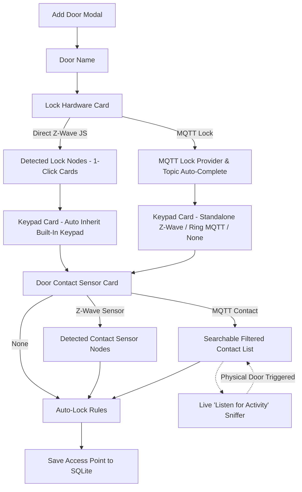

# Design Document: Intelligent Door Setup Wizard & Smart MQTT Topic Discovery

**Date**: 2026-09-07  
**Status**: Approved  
**Author**: Antigravity & Steven T. Pelech  
**System**: AccessControl (v2.0.0+)

---

## 1. Problem Statement

Adding an Access Point (door) in AccessControl currently suffers from severe UX friction:
1. **Confusing Transports**: The UI displays generic lock options (`AugustZWave`, `SchlageZWave`, `SwitchBotMqtt`, `GenericMqtt`) alongside raw MQTT topic input boxes even when a direct Z-Wave JS WebSocket transport is in use. Users don't know whether to enter a node ID or an MQTT path, and seeing MQTT fields when configuring a direct Z-Wave lock creates confusion.
2. **"Data Vomit" Button Cloud**: The MQTT discovery service performs overly broad string matching (`topic.Contains("sensor")`). In a typical homelab environment, this dumps 50+ unrelated metric topics (`linkquality`, `battery`, `temperature`, `humidity`, `voltage`, `power`, `tamper`) as an unorganized cloud of tiny button pills directly on the modal screen.
3. **Missing Context & Friendly Names**: Raw MQTT strings like `zigbee2mqtt/0x00158d0006b23c8f` give the user zero clue as to which physical door or device model they correspond to, what payload schema they expect, or what state they are currently in.
4. **Lack of Live Feedback**: Users cannot verify whether a selected contact topic actually corresponds to their physical door before saving.

---

## 2. Proposed Architecture & UX Solution

The redesigned door setup system replaces the data vomit with **Dynamic Progressive Disclosure** on the frontend, supported by an **Intelligent MQTT Topic Inspector & Discovery Service** on the backend.



### 2.1 Dynamic Progressive Disclosure
- **Lock Hardware Card**:
  - Segmented toggle: `Direct Z-Wave JS` vs `MQTT Lock`.
  - In `Direct Z-Wave JS` mode:
    - Renders clean discovered node cards (Node ID, Device Name, Model, Battery %, Status).
    - Clicking a card auto-populates `name` (if empty), sets `lockProviderType = "ZWaveWebSocket"`, and locks `nodeId`.
    - **Completely removes all MQTT path/topic input fields and irrelevant provider dropdowns.**
  - In `MQTT Lock` mode:
    - Renders provider types (`GenericMqtt`, `SwitchBotMqtt`) and a clean topic input with auto-complete.
- **Context-Aware Keypad Selection**:
  - When an integrated deadbolt is chosen (e.g. Node 39 Schlage BE469ZP):
    - Automatically defaults to `Built-In Lock Keypad` (`providerType: "BuiltInKeypad"`, inherits `nodeId: 39`).
    - Explicitly clarifies: *"Uses Node 39 hardware keypad. PIN slots sync directly."*
  - Other options: `Standalone Z-Wave Keypad` (lists detected keypad nodes like Node 40 Ring v2), `Ring / MQTT Keypad`, or `None (App Only)`.
- **Door Contact Sensor Selection**:
  - Segmented toggle: `None` | `Z-Wave Sensor` | `MQTT Contact`.
  - When `MQTT Contact`:
    - Renders a clean searchable dropdown showing friendly device names, integration sources, models, and current status (`[Closed]` / `[Open]`).
    - Provides a "Custom Topic" toggle for free-form topics.
    - Features an interactive **"⚡ Listen for Activity"** sniffer button.
- **Auto-Lock Rules**:
  - Clean drawer with Day slider (default 300s), Night slider (default 60s), and "Sensor-Aware Guard" status pill.

---

## 3. Backend Discovery & Sniffer Specification

### 3.1 Strict Binary Contact Sensor Filtering (`MqttTopicDiscoveryService.cs`)
1. **Metric Blacklist**:
   Explicitly exclude any topic or payload key containing:
   `battery`, `linkquality`, `temperature`, `humidity`, `illuminance`, `power`, `voltage`, `energy`, `action`, `update`, `tamper`, `rssi`.
2. **Contact Sensor Qualification**:
   A topic qualifies as a door contact sensor only if:
   - Topic ends with `/contact`, `_contact`, or contains `door_contact` / `contact_sensor`, OR
   - Payload contains a boolean JSON property `"contact": true|false` (standard Zigbee2MQTT), OR
   - Payload contains a state string `"ON"` / `"OFF"` or `"OPEN"` / `"CLOSED"` on a binary sensor topic (standard Home Assistant / Ring).
3. **Friendly Name Resolution**:
   - Ingests `homeassistant/binary_sensor/+/config` and `zigbee2mqtt/bridge/devices` announcements to extract `name`, `manufacturer`, `model`, and `friendly_name`.
   - Normalizes raw topics to friendly UI entities:
     ```json
     {
       "topic": "zigbee2mqtt/front_door_contact",
       "deviceName": "Front Door Contact",
       "integration": "Zigbee2MQTT",
       "model": "Aqara MCCGQ11LM",
       "currentState": "closed",
       "lastSeen": "2026-09-07T12:00:00Z"
     }
     ```

### 3.2 Live "Listen for Activity" Sniffer Endpoint
- **Endpoint**: `GET /api/discovery/sniff?since={isoTimestamp}`
- **Behavior**:
  - Maintains a sliding circular buffer (last 50 events) of MQTT messages with timestamps.
  - When called with `since`, filters for events occurring strictly after `since`.
  - Identifies state change deltas on contact sensors.
  - Returns:
    ```json
    {
      "detected": true,
      "event": {
        "topic": "zigbee2mqtt/front_door_contact",
        "deviceName": "Front Door Contact",
        "model": "Aqara MCCGQ11LM",
        "state": "OPEN",
        "timestamp": "2026-09-07T12:01:05.120Z"
      }
    }
    ```
  - If no event has arrived since the timestamp: returns `{"detected": false}`.

---

## 4. End-to-End Testing Strategy (No "Test Theatre")

We enforce controls-grade, closed-loop verification across both backend and frontend.

### 4.1 Backend Integration Tests (`AccessControl.Tests.Harness`)
- **Test 1: Strict Topic Filtering & Metric Rejection**:
  - Feed simulated MQTT stream containing 20 mixed topics (`zigbee2mqtt/kitchen/temperature`, `zigbee2mqtt/front_door/battery`, `zigbee2mqtt/front_door/linkquality`, `zigbee2mqtt/front_door/contact`, `homeassistant/binary_sensor/dining_door/state`).
  - Query `GetDiscoveredTopics("sensor")`.
  - Assert that ONLY true contact topics are returned; assert zero metric pollution.
- **Test 2: Live Activity Sniffer Closed Loop**:
  - Record baseline timestamp $T_0$.
  - Call `GET /api/discovery/sniff?since=T_0` -> assert `detected: false`.
  - Publish contact state change payload to `zigbee2mqtt/side_entry_contact` (`{"contact": false}`).
  - Call `GET /api/discovery/sniff?since=T_0` -> assert `detected: true`, matching topic, device name, and `OPEN` state.
- **Test 3: Door Persistence with Resolved Config**:
  - Call `POST /api/access-points` with the payload generated by the redesigned wizard (Direct Z-Wave Lock Node 39 + Built-In Keypad + Sniffed Zigbee Contact Sensor).
  - Query SQLite database directly via Dapper.
  - Assert database record matches exact JSON schema, foreign keys, and provider contracts.

### 4.2 Frontend Vitest Tests (`src/AccessControl.UI`)
- **DoorSetupWizard.test.tsx**:
  - Verifies toggling between Direct Z-Wave and MQTT dynamically mounts/unmounts input fields.
  - Verifies selecting an integrated lock card automatically selects `Built-In Lock Keypad` and disables contradictory options.
  - Verifies sensor dropdown lists friendly names and does NOT render raw button tag swarms.
  - Verifies the "Listen for Activity" pulsing state and successful match resolution.

### 4.3 Automated Playwright Harness Flow (`harness/specs/flows.spec.ts`)
- Target live running stack (`http://127.0.0.1:8150`):
  - Flow 3 executes complete door configuration journey:
    1. Opens modal.
    2. Enters door name.
    3. Selects Direct Z-Wave JS Node 39 card.
    4. Confirms zero MQTT fields exist in the DOM.
    5. Confirms Built-in Keypad is auto-selected.
    6. Selects MQTT Contact Sensor from the filtered friendly dropdown.
    7. Tests Auto-Lock slider adjustment.
    8. Submits the form.
    9. Asserts newly created door card appears in the active Doors dashboard with correct state badges.
  - Captures full visual artifact and publishes to the Agent Preview Hub.

---

## 5. Migration & Backward Compatibility
- Existing access point configurations in SQLite remain 100% valid; JSON schema for `lockConfigJson`, `keypadConfigJson`, and `doorSensorConfigJson` is unchanged.
- Legacy doors configured with MQTT topics load into the wizard's `MQTT Lock` view seamlessly without loss of configuration.
